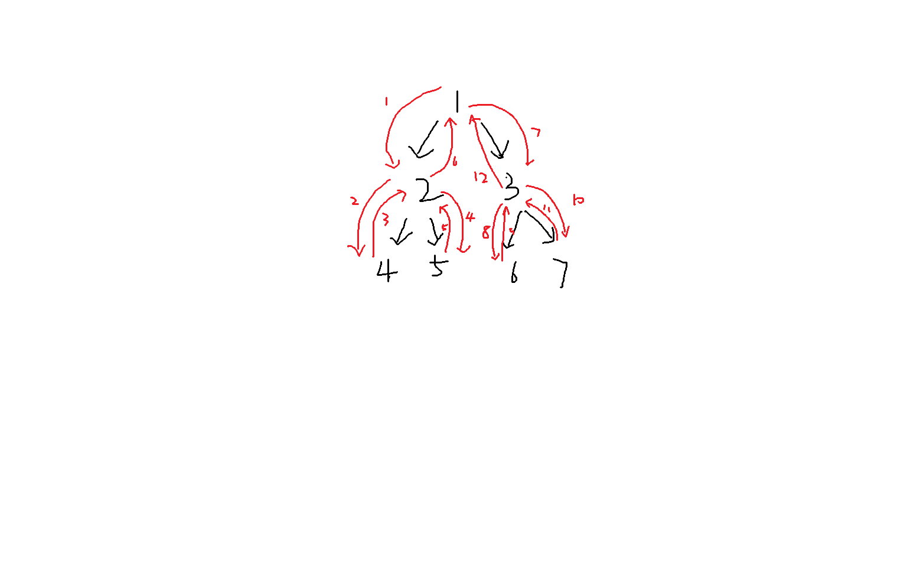

## step1.什么是树

#### 现在先了解什么是树，给树下一个定义。什么是二叉树？该如何定义一个二叉树？

树是无环的连通无向图；二叉树是每个节点至多有两个有序的子节点（左子树和右子树）的树；定义每个节点和该节点的左子树和右子树

#### 在这一题中我们只讨论二叉树。请你思考，二叉树在c语言中应该如何存储？二叉树有哪些特点？

1.数组写法：以1为根节点，设节点为x，则x的左子树为2*x，右子树为2*x+1，对于高度为d的树，至少要2^d大小的数组才能**完全**保证存下这棵树

2.指针写法：定义结构体

```c
typedef struct TreeNode{
	int val;
    struct TreeNode *l, *r;
} TreeNode; 
```

其中`val`为节点存储的数据，`l`和`r`分别为结点的左子树和右子树

3.二叉树的特点

有n个结点的二叉树，边数为n−1。

第i层最多有2i−1个结点（根为第 1 层）。

深度为k的二叉树最多有2k−1个结点。

叶子结点数n0与度为 2 的结点数n2满足：n0=n2+1


```c
#include <stdio.h>
#include <stdlib.h>
#include <stdbool.h>

#define MAX_TREE_SIZE 100
#define SeqBiTree SBT
/*
 *  * 顺序存储二叉树结点
 *   *  - data：结点数据
 *    * - used：当前位置是否有结点
 *     */
typedef struct {
	int data;
	bool used;
} SeqTreeNode;

/*
 *  * 顺序存储二叉树
 *   * - nodes：结点数组
 *    * - size：数组最大容量
 *     */
typedef struct {
	SeqTreeNode nodes[MAX_TREE_SIZE];
	int size;
} SeqBiTree;

void init(SeqBiTree *sbt)
{
	sbt->size = 0;//初始大小为0
	for (int i = 0; i < MAX_TREE_SIZE; i++)
		sbt->nodes[i].data = 0, sbt->nodes[i].used = false;//所有节点赋值为0，没用过
}

void set_root(SBT *t, int val)
{
	t->nodes[1].data = val;//赋值
	t->nodes[1].used = true;//标记用过
	t->size++;
}

//合并set_left_child和set_right_child
void set_child(SeqBiTree *t, int parent_node, int val, int opt) // opt:0左1右
{
	if (opt)
	{
		t->nodes[parent_node*2+1].data = val;
		t->nodes[parent_node*2+1].used = true;
		t->size++;
	}
	else
	{
		t->nodes[parent_node*2].data = val;
		t->nodes[parent_node*2].used = true;
		t->size++;
	}
}

void level_order(SeqBiTree *t)
{
	for (int i = 0; 1<<i <= t->size; i++)// 高度为i的树节点个数最大2^i（i从0开始）
	{
		for (int j = 1<<i; j < 1<<(i+1); j++)//遍历每一层
		{
			if (!t->nodes[j].used) printf("-1 ");
			else printf("%d ", t->nodes[j].data);
		}
		printf("\n");
	}
}

signed main()
{
	SBT *sbt = (SBT *)malloc(sizeof(SBT));
	init(sbt);
	set_root(sbt, 1);
	set_child(sbt, 1, 2, 0);
	set_child(sbt, 1, 3, 1);
	set_child(sbt, 2, 4, 0);
	set_child(sbt, 2, 5, 1);
	set_child(sbt, 3, 6, 0);
	set_child(sbt, 3, 7, 1);
	level_order(sbt);
	free(sbt);
	sbt = NULL;	
	return 0;
}
```

output:

```shell
1
2 3
4 5 6 7
```


## step2.链二叉树

```c
#include <stdio.h>
#include <stdlib.h>

typedef struct TreeNode {
    int data;                       // 节点存储的数据
    struct TreeNode *left;          // 左子树指针
    struct TreeNode *right;         // 右子树指针
} TreeNode;

TreeNode *create_node(int val)
{
	TreeNode *r = (TreeNode *)malloc(sizeof(TreeNode));
	if (!r) exit(1);
	r->data = val;
	r->left = NULL, r->right = NULL;
	return r;
}

signed main()
{
	TreeNode *root = create(1);
	root->left = create(2), root->right = create(3);
	root->left->left = create(4), root->left->right = create(5);
	root->right->left = create(6), root->right->right = create(7);
	return 0;
}
```


**聪明的你会发现，只使用简单的for循环无法实现这个打印函数。请你讲讲问什么无法实现。**

用链二叉树时各节点在内存中不连续，无法简单遍历打印


## step3.递归

**请你自行了解什么是二叉树的前序遍历，中序遍历，后序遍历。然后在上面的链二叉树代码文件中，实现这三个函数。并在主函数中调用这三个函数打印遍历结果。**

```c
#include <stdio.h>
#include <stdlib.h>
#include <math.h>

typedef struct TreeNode {
	int data;                       // 节点存储的数据
	struct TreeNode *left;          // 左子树指针
	struct TreeNode *right;         // 右子树指针
}TreeNode;

typedef struct Stack {
    TreeNode **arr;
    int top;
    int capacity;
} Stack;
Stack *createStack(int capacity) { //初始化Stack
    Stack *stack = malloc(sizeof(Stack));
    stack->arr = malloc(sizeof(TreeNode *) * capacity);
    stack->top = -1;
    stack->capacity = capacity;
    return stack;
}
int isEmpty(Stack *stack) { //判断是否为空
    return stack->top == -1;
}
void push(Stack *stack, TreeNode *node) {//压栈
    if (stack->top == stack->capacity - 1) {
        return;
    }
    stack->arr[++stack->top] = node;
}
TreeNode *pop(Stack *stack) {//弹栈
    if (isEmpty(stack)) {
        return NULL;
    }
    return stack->arr[stack->top--];
}

void preorderTraversal(TreeNode *root)
{
	Stack *s = createStack(7);
	push(s, root);
	while (!isEmpty(s))
	{
		TreeNode *r = pop(s);
		if (!r) continue;
		printf("%d ", r->data);
		push(s, r->right), push(s, r->left);
	}
}	// 补全这个函数

TreeNode *create_node(int data)
{
	TreeNode *r = (TreeNode *)malloc(sizeof(TreeNode));
	if (!r) exit(1);
	r->left = NULL, r->right = NULL;
	r->data = data;
	return r;
}

TreeNode *build(int x, int N)
{
	if (x > N) return NULL;
	TreeNode *r = create_node(x);
	r->data = x;
	r->left = build(2*x, N), r->right = build(2*x+1, N);
	return r;
}

void pre(TreeNode *r)
{
	if (!r) return;
	printf("%d ", r->data);
	pre(r->left), pre(r->right);
}

void mid(TreeNode *r)
{
	if (!r) return;
	mid(r->left);
	printf("%d ", r->data);
	mid(r->right);
}

void suf(TreeNode *r)
{
	if (!r) return;
	suf(r->left);
	suf(r->right);
	printf("%d ", r->data);
}

int max(int a, int b)
{
	return a>b? a: b;
}

int dep(TreeNode *r)
{
	if (!r) return 0;
	return 1+max(dep(r->left), dep(r->right));
}

int depth(TreeNode *r, int current_depth, int max_depth){
	if (!r) return max_depth; //返回最大深度
	max_depth = max(max_depth, current_depth);//更新最大深度
	int lmax = depth(r->left, current_depth+1, max_depth);
	int rmax = depth(r->right, current_depth+1, max_depth);
	return max(lmax, rmax);//返回左右子树最大深度
}


int main()
{
	TreeNode *root = NULL;
	root = build(1, 7);
	int cd = 1, md = 1;
	printf("%d %d\n", dep(root), depth(root, cd, md));
	pre(root);
	printf("\n");
	mid(root);
	printf("\n");
	suf(root);
	printf("\n");
	preorderTraversal(root);
	printf("\n");
	return 0;
}
```

output：

```shell
3 3
1 2 4 5 3 6 7
4 2 5 1 6 3 7
4 5 2 6 7 3 1
1 2 4 5 3 6 7
```


**请你思考上面递归的过程，讲讲为什么只改变printf函数出现的位置就可以实现这三种不同的递归。以前序遍历为例，讲讲二叉树中递归的过程。**

改变了打印节点的时机，前序遍历先打印节点在打印左右子树 `1 l... r...`，中序遍历则先打印左子树再打印节点再打印右子树 `l... 1 r...` ，后序遍历同理



红色为递归顺序


**int depth(TreeNode *root, int current_depth, int max_depth) 通过这个函数实现对树的深度的统计。并讲讲为什么后面两个int不需要使用指针变量。**

current_depth表示当前节点深度，进入函数后不需要修改，而max_depth是为了记录各叶子末端的深度最大值，在递归到末端时返回。

**相信你在使用递归的过程中，一定感觉递归和循环有很多相似之处，请你讲讲你对这两种算法的感悟。**

递归是把大问题拆分成小问题，一步一步拆成可以轻易解决的最小问题，循环和递归相反，符合人的直觉，一步一步解决问题

**并利用栈操作实现二叉树的前序遍历，不许使用递归。**

代码见上