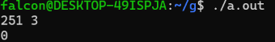
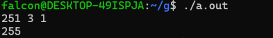
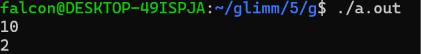
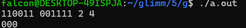
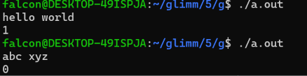
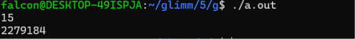
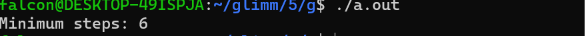

# MEDIUM-1：位级操作

**【任务 1】**

舰长手册上留下的密码是：211（十进制） 和 10110110（二进制）。

请写出十进制 211 对应的二进制表示。

11010011 (短除法)

请写出二进制 10110110 对应的十进制表示。

182 = 2+4+16+32+128

在 C/C++ 中，如何快速判断一个十进制整数是奇数还是偶数？

一个十进制数x,转换为二进制数
$$
x = a_n*2^n+a_{n-1}*2^{n-1}+...+a_1*2+a_0 = 2*(a_n*2^{n-1}+...+a_1)+a_0
$$
其中
$$
a_i \in \{0,1\} ,(i = 1,2,3,4,...n)
$$
可以看到，a_0左边可以被2整除，所以x的奇偶由a_0即第0位数决定，当a_0 == 0,x为偶数，a_0 == 1,x为奇数.

所以只需要x&1 == 0，x为偶数，x&1 == 1，x为奇数.


**【任务 2】**

阅读并推导以下 C/C++ 代码的输出结果，并简要解释你的计算结果：

```c
#include <stdio.h>

int main() {
    unsigned char a = 12;  // 二进制: 00001100
    unsigned char b = 25;  // 二进制: 00011001

    unsigned char res1 = a & b;
    unsigned char res2 = a | b;
    unsigned char res3 = a ^ b;
    unsigned char res4 = (a << 2) | (b >> 1);

    printf("%d %d %d %d\n", res1, res2, res3, res4);
    return 0;
}
```

$$
res1 = (00001000)_2 = 8\\
res2 = (00011101)_2 = 29\\
res3 = (00010101)_2 = 21\\
a << 2 = (00110000)_2 \\
b >> 1 = (00001100)_2 \\
res4 = (00111100)_2 = 60
$$

所以输出：

```shell
8 29 21 60
```

给定一个整数x（十进制），同时指定一个**位数**n，确定这个整数x的二进制表示上第n位是0还是1。例如：251的二进制表示是11111011，n=3，结果返回0。

```c
#include <stdio.h>

int x, idx;

int main()
{
	scanf("%d%d", &x, &idx);
	printf("%d\n", (x>>(idx-1)) &1);
	return 0;
}
```



给定一个整数x（十进制），指定一个**位数**n，给定一个修正值t（0或者1），将整数x的二进制表示上的第n位改为修正值t。输出被修改后的整数。

```c
#include <stdio.h>

int x, n, t;

int main()
{
        scanf("%d%d%d", &x, &n, &t);
        if (t) printf("%d\n", x|(1<<(n-1)));
        else printf("%d\n", x&~(1<<(n-1)));
        return 0;
}
```



给定一个有符号32位整数x，找到其二进制表示上从右开始的第一个1，并输出该数，例如：x=10,二进制表示为1010,第一个1在第二位，所以输出二进制表示为10的数2。

```c
#include <stdio.h>

int x;

int lowbit(int x)
{
        return x&-x;
}

int main()
{
        scanf("%d", &x);
        printf("%d\n", lowbit(x));
        return 0;
}
```



现在有两串无符号数a和b的二进制编码，并且有a<b，每个数字的大小在100位以内，现在问区间[a,b]内&的结果。

```c
#include <stdio.h>
#include <stdbool.h>

bool a[101], b[101];
int sza, szb, l, r;

int main()
{
        char ch;
        while ((ch = getchar()) != ' ')
                a[++sza] = ch-'0';
        while ((ch = getchar()) != ' ')
                b[++szb] = ch-'0';
        scanf("%d%d", &l, &r);
        for (int i = l; i <= r; i++)
                printf("%d", a[i]&b[i]);
        printf("\n");
        return 0;
}
```




在接触了C语言这么长时间后，相信你已经对逻辑运算了如指掌了，那么你能说说看逻辑运算和位运算的区别和联系吗。思考并提交于**markdown文档**。

**位运算**：针对数之间的运算，结果是一个数，没有短路机制

**逻辑运算**：针对布尔代数的运算，只有true或false两种取值（返回值），有短路机制，比如  `1 == 2 && 1当判断第一个1==2为false后直接返回false

而不再判断1是否为true

位运算的定义很简单，但是再简单的定义也可能产生一些有用的性质（比如运算律）。查阅资料了解位运算有哪些性质。

- **交换律**：`a & b = b & a`，`a | b = b | a`，`a ^ b = b ^ a` 
- **结合律**：`(a & b) & c = a & (b & c)`，`(a | b) | c = a | (b | c)`，`(a ^ b) ^ c = a ^ (b ^ c)` 
- **分配律**：`a & (b | c) = (a & b) | (a & c)`，`a | (b & c) = (a | b) & (a | c)` 
- **幂等律**：`a & a = a`，`a | a = a` 
- **零与单位律**：`a & 0 = 0`，`a | 0 = a`，`a ^ 0 = a`，`a ^ a = 0` 
- **取反律**：`a & ~a = 0`，`a | ~a = -1`（补码表示）

[位运算的一些性质_结合律 位运算-CSDN博客](https://blog.csdn.net/wanglianda2007/article/details/129544037)

移位运算中，右移有两种，其中算数右移对应有符号数，逻辑右移对应无符号数，那么为什么会有这种区别呢。查阅资料理解整数的补码表示后回答于**markdown文档**。

正数补码：与原码完全一致。

负数补码：在原码基础上，符号位保持不变，数值位取反（得到反码），再加 1。

**逻辑右移**：所有位右移，在高位补0，无符号数/2

**算数右移**：所有位右移，在高位补符号位（负数补1，非负数补0），有符号数/2

所以算数右移使为了让有符号数的符号不在移位中发生变化


**【任务 3】编程题：字符串交集检测**

```c
#include <stdio.h>

// 请补全以下代码
int hasCommonChar(const char *s1, const char *s2) {
     	int mask1 = 0;
     	int mask2 = 0;
	for (int i = 0; s1[i]; i++) mask1 |= 1<<(s1[i]-'a');
	for (int i = 0; s2[i]; i++) mask2 |= 1<<(s2[i]-'a');
	return !!(mask1&mask2);
}

char a[100001], b[100001];

int main()
{
	scanf("%s%s", a, b);
	printf("%d\n", hasCommonChar(a, b));
	return 0;
}
```




**【任务 4】给定反应堆的规模 N\*N\* (1≤N≤151≤\*N\*≤15)，请使用位运算实现求解控制棒摆放方案的总数**

```c
#include <stdio.h>

int N, Mask;
long long ans;

void dfs(int n, int col, int diag, int diag1) //状态压缩，col,diag,diag1分别表示n层时纵列，主对角线，副对角线对第n层的覆盖情况 1为覆盖
{
        if (!n)
        {
                ans++;
                return;
        }
        int msk = ~(col|diag|diag1) & Mask; //计算可放置的格子位置，1为可放置
        for (int i = msk&-msk; msk; msk-=i, i = msk&-msk) //i每次取msk的最低位1
                dfs(n-1, col|i, (diag<<1)|(i<<1), (diag1>>1)|(i>>1));
    //举例，标记新放置的皇后x为2（实际是1）
    //col   0001000
    //diag  0010000
    //diag1 0000100
    //放置在第1位后(从0开始计数)
    //考虑x对下一行的影响
    //n   0000020
    //n-1 0000222
    //col移动到下一行  0001000，再加上x对下一行的影响，0001020
    //diag移动到下一行 0100000，再加上x对下一行的影响，0100200
    //diag1移动到下一行0000010，再加上x对下一行的影响，0000012
    //下一行msk 1010000
}

int main()
{
        scanf("%d", &N);
        Mask = (1<<N)-1; //限制每行长度
        dfs(N, 0, 0, 0);
        printf("%lld\n", ans);
        return 0;
}
```




**【任务 5】编程题：广度优先搜索 (BFS) 与位运算寻路**

```c
#include <stdio.h>
#include <stdbool.h>

// 定义简单队列结构用于 BFS
typedef struct {
    int pos;   // 当前节点编号 (0~15)
    int dist;  // 到达当前节点的最短步数
} Node;

int minStepsToCheese(int walls) {
    int start = 0;
    int target = 15;

    // 如果起点或终点本身是墙，直接不可达
    if ((walls & (1 << start)) || (walls & (1 << target))) {
        return -1;
    }

    // BFS 队列与访问位图
    Node queue[16];
    int front = 0, rear = 0;
    int visited = 0;

    // 起点入队并标记已访问 (请使用位运算)
    queue[rear++] = (Node){start, 0};
    visited |= (1 << start);

    // 上、下、左、右四个方向的节点偏移量
    int dr[4] = {-1, 1, 0, 0};
    int dc[4] = {0, 0, -1, 1};

    //请在TO DO 和END OF TO DO 行之间补全代码：
    //TO DO
    while (front != rear)
    {
	    Node u = queue[front%16];
	    front++;
	    visited |= (1 << u.pos);
	    if (u.pos == 15) return u.dist;
	    for (int i = 0; i < 4; i++)
	    {
		    int x = u.pos%4+dr[i], y = u.pos/4+dc[i], p = x+4*y;
		    if (x > 4 || x < 0 || y > 4 || y < 0 || visited & (1<<p) || walls>>p & 1) continue;
		    queue[rear%16] = (Node){x+4*y, u.dist+1};
		    rear++;
	    }
    }

    //END OF TO DO

    return -1; // 无法到达
}

int main() {
    int walls = (1 << 5) | (1 << 10); // 5号和10号格子是墙
    int steps = minStepsToCheese(walls);
    printf("Minimum steps: %d\n", steps); // 应输出 6
    return 0;
}
```



